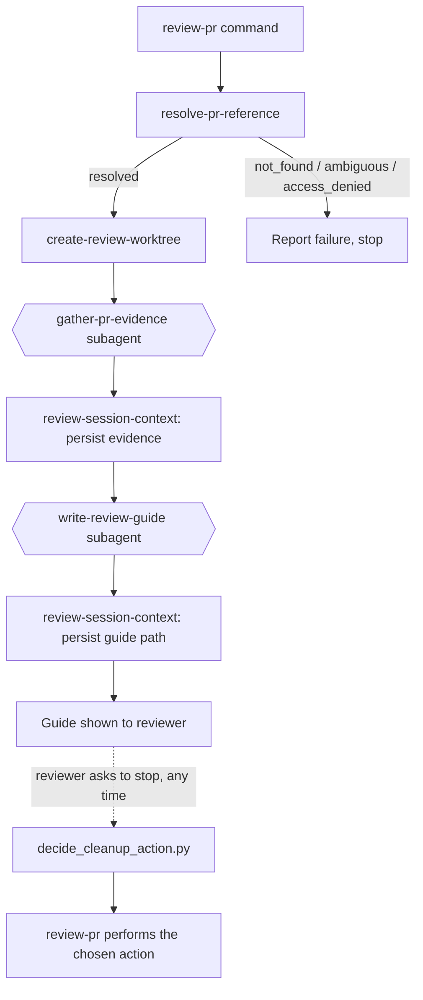

# Review PR: Reference Resolution & Guide

> **Status:** Draft
> **Design:** [Code Review Helper](docs/_design_code-review-helper.md) — implements Deliverable 1
> **Architecture doc:** — none yet; authored by this spec's final task once implementation completes

## Contents

- [Overview](#overview)
- [Responsibilities & Boundaries](#responsibilities--boundaries)
- [Key Design Decisions](#key-design-decisions)
- [Component Breakdown](#component-breakdown)
- [Planned Implementation](#planned-implementation)
- [Related Features](#related-features)
- [Open Questions](#open-questions)
- [Related Docs](#related-docs)

## Overview

A new `/dev-team:review-pr <ref> [prose]` command resolves a PR reference (number, URL, or
work-item ID) to exactly one target PR, stands up an isolated worktree or clone checked out to
that PR's head, gathers evidence (diff, description, existing comments, related work items), and
generates a standalone navigation guide. This is the shared bootstrap every other Code Review
Helper deliverable builds on: PR resolution, isolation, evidence, and session-state persistence
all live here, even though this spec's own scope stops at the guide.

## Responsibilities & Boundaries

- **Owns:** resolving a PR reference to exactly one target PR (or a specific failure reason);
  creating and tearing down an isolated review worktree/clone; gathering PR evidence; generating
  the review guide; persisting review-session state for the rest of the conversation and for
  later deliverables to read.
- **Does not own:** specialist review passes, gated publishing, the comprehension quiz, the
  author-side response flow, or specialist-outcome logging — each is a separate spec (see
  [Related Features](#related-features)) that reads this deliverable's resolved PR, worktree, and
  session-context file rather than re-resolving any of it.
- **Integrates with:** `work-with-pr` (inline review-comment reads), `work-with-Jira-tasks` and
  `work-with-GitHub-issues` (per-provider work-item resolution and related-item lookup),
  `find-repo-documentation` (guide doc citations), the native `EnterWorktree`/`ExitWorktree` tools
  (same-repo isolation), `get-project-configuration` (work-tracking provider patterns).

## Key Design Decisions

### Single prose-driven entry point, not flag-based sub-commands

_Context:_ The reviewer needs to request guide/report/quiz/publish/cleanup in any combination,
at any point in an ongoing session — including mid-flight (e.g. requesting the quiz while
specialist passes are still running in the background). A fixed set of CLI flags parsed once at
invocation can't express "ask for something new three turns later."
_Decision:_ One command, `/dev-team:review-pr <ref> [prose]`, bootstraps a session (resolve →
worktree → evidence → guide, the scope of this spec) and remains the active skill for the rest of
the conversation: further natural-language requests in the same session are interpreted and
dispatched to whichever capability skill applies. This spec implements the bootstrap and the
default guide generation; later deliverables register their own dispatch behavior against the
same command rather than introducing separate commands.
_Consequences:_ No formal argument grammar to unit test — dispatch correctness depends on the
command's own prose being unambiguous, not on parsing logic. The command counts as
Orchestrator-tier, verified the way `component-taxonomy` verifies agent-skill prose (evals), not
via TDD.

### Bare number resolves in the current repo; only a full URL crosses repos

_Context:_ The tool must support reviewing PRs in repos other than the one currently checked
out, but a bare PR number is inherently repo-relative — there is no number-only syntax that
unambiguously names a PR in an arbitrary repo.
_Decision:_ A bare integer (or `#123`) always resolves against the current repo's `origin`. A
full `https://github.com/<owner>/<repo>/pull/<number>` URL resolves against the named repo,
which may or may not be the current one. A work-item ID resolves via the lookups below and
carries its own owner/repo with it once found.
_Consequences:_ `create-review-worktree` must branch on same-repo vs. cross-repo (see next
decision) rather than assuming the target is always the current checkout.

### Same-repo PRs use a worktree; cross-repo PRs use a scratch clone

_Context:_ The native `EnterWorktree` tool only operates on the repo the session is already in —
it has no notion of an arbitrary other repo. A genuinely different repo has no local `.git` to
worktree against.
_Decision:_ When the resolved PR's repo matches the current repo, use `EnterWorktree` for
isolation (matches this plugin's existing "fresh, uniquely-named, no reuse" convention), then run
`gh pr checkout <number>` inside it to move off the tool's default fresh-branch-from-main and
onto the PR's actual head. When the resolved PR's repo is a different repo entirely, check one
conventional sibling location first — `../<repo>`, relative to the current repo's parent
directory (no new config field): if a git repo matching that `owner/repo` is found there, run
`git worktree add` from it instead of cloning. Otherwise, `gh repo clone <owner>/<repo>` into a
scratch directory under `.claude/worktrees/review-<owner>-<repo>-<number>/`. Either way, check
out the PR the same way once the working copy exists.
_Consequences:_ Cleanup must branch on which path was taken: `ExitWorktree` for the same-repo
case, `git worktree remove` for a sibling-clone worktree, or a plain confirmed directory removal
for a cross-repo scratch clone. The sibling check is a pure optimization — a miss always falls
through to the clone path, so it never affects correctness. A sibling-clone worktree is created
with plain `git worktree add`, not `EnterWorktree`, so it isn't covered by Claude Code's own
automatic worktree-isolation enforcement — cleanup must explicitly `git worktree remove` it
rather than assume the harness will. "Current repo"
throughout this spec means the repo `git remote get-url origin` points to in the calling session,
parsed the same way `use-context-file`'s `compute-context-file.py` already derives a repo slug —
reused rather than reinvented. `EnterWorktree` itself takes no name/path parameter for fresh
creation (it auto-assigns the worktree's directory under `.claude/worktrees/`), so the same-repo
case's worktree directory name won't follow the `review-<owner>-<repo>-<number>` convention that
only the cross-repo scratch-clone/sibling-worktree paths use.

### Cleanup separates a testable decision script from agent-performed actions

_Context:_ Cleanup's three-way branch (`ExitWorktree` / `git worktree remove` / a confirmed
`rm -rf`) is real decision logic worth testing, but `ExitWorktree` (like `EnterWorktree`) is a
native tool callable only from the agent's own tool-use turn — no script in this repo calls it,
and none can. A pytest suite can't exercise a branch whose action is an agent tool call.
`ExitWorktree` itself only restores the calling session's working directory to where it was
before entry — it does not delete the worktree or its branch, so the same-repo case needs an
explicit follow-up removal too, not `ExitWorktree` alone.
_Decision:_ `.dev-team-review.md` gains an `isolation_kind` field
(`enterworktree`|`sibling-worktree`|`scratch-clone`) recording exactly which mechanism
`create-review-worktree` used — the thing cleanup actually needs to branch on, which `repo_scope`
alone doesn't capture (a cross-repo PR can take either the sibling-worktree or scratch-clone
path). `decide_cleanup_action.py` reads it and returns a plain descriptor with no side effects of
its own:
- `{"action": "exit_worktree", "path": "..."}` (same-repo) — `review-pr` calls `ExitWorktree`,
  then `git worktree remove <path>` and `git branch -D <branch>`, since `ExitWorktree` alone
  leaves both in place.
- `{"action": "git_worktree_remove", "path": "..."}` (sibling-worktree) — `review-pr` runs
  `git worktree remove <path>` and `git branch -D <branch>` directly (no `ExitWorktree` involved,
  since this worktree was never entered through it).
- `{"action": "rm_rf", "path": "..."}` (scratch-clone) — `review-pr` confirms, then `rm -rf`s the
  whole clone directory; no separate branch deletion applies, since the clone's own `.git` (and
  the branch inside it) is removed along with everything else.

`review-pr` (Task 6) performs whichever action the descriptor names.
_Consequences:_ The pytest suite covers `decide_cleanup_action.py`'s branching in full; the actual
tool/CLI invocation is exercised only by manual/eval testing of the `review-pr` command itself,
consistent with `component-taxonomy`'s Orchestrator tier (wiring, not logic risk).

### Work-item-ID resolution checks the implement pipeline's own context file first, then dispatches by provider

_Context:_ A work-item ID handed to `review-pr` is often a task-work-item this plugin's own
`/implement` pipeline already produced a PR for — that PR URL is already recorded and re-deriving
it would be redundant. Otherwise, it could be a Jira issue or a GitHub issue — this project's own
`work-tracking` config has both providers configured, so resolution can't assume Jira.
`identify-project-work-items` itself isn't usable here: when a ref matches no configured
provider's pattern, its own documented fallback is to interactively ask the user "What work item
are you working on?" — never appropriate for `resolve-pr-reference`'s fully-automated
`not_found`/`ambiguous`/`access_denied` contract, and impossible from `gather-pr-evidence`'s
subagent context, where there's no user turn to ask into.
_Decision:_ First check for an existing `use-context-file` context file for that work-item ID; if
found and its `pr_url` field is set, use it directly. Otherwise, `resolve_pr_reference.py` matches
the ref directly against `work-tracking.<provider>.issue-key-pattern`/`recognize-patterns` from
`get-project-configuration` — the same two fields `identify-project-work-items` itself matches
against, just applied deterministically in-script instead of through that skill, so no match ever
falls through to its interactive default. No match against any provider's patterns (and no URL/
number shape either) is `not_found` — never a prompt. A match identifies both the work-item-id and
its provider in the same step, then dispatches:
- **Jira:** query the `getJiraIssueRemoteIssueLinks` operation (added to `work-with-Jira-tasks` by
  this spec) for the issue's linked PRs. `getJiraIssueRemoteIssueLinks` hits Jira's generic Remote
  Issue Links API, not the Development panel's separate dev-status API — no MCP tool connected in
  this environment exposes the dev-status API, so a PR linked only via Smart Commits/branch-name
  convention (and never added as an explicit remote link) won't show up here. When it returns
  nothing, fall back to a GitHub search (`gh pr list`/`gh search prs`) for the issue key in PR
  titles, bodies, or branch names, so a dev-panel-only link still resolves.
- **GitHub:** query a new `getLinkedPullRequests` operation, added to `work-with-GitHub-issues` by
  this spec: `gh api graphql` reading the issue's `closedByPullRequestsReferences` connection for
  its linked PRs. Unlike the Jira path, this is a plain CLI call, not an MCP tool.

Either path: zero links found (after any fallback) or more than one is reported as
`not_found`/`ambiguous` respectively — never guessed.
_Consequences:_ Both `work-with-Jira-tasks` and `work-with-GitHub-issues` gain one new operation
each. The Jira path now depends on two signals (remote links, then GitHub search) rather than one,
so `resolve-pr-reference`'s `source` field must distinguish which one actually produced the match
(see [Interfaces](#interfaces)).

### resolve-pr-reference splits a testable script from one inline MCP call

_Context:_ Every resolution path is a deterministic `gh` CLI/GraphQL call or a file read —
scriptable and pytest-testable — **except** the Jira remote-links lookup, which is an MCP tool
call (`getJiraIssueRemoteIssueLinks`) and, like `ExitWorktree` above, only callable from the
agent's own tool-use turn. No script in this repo calls an MCP tool, and none can.
_Decision:_ `resolve-pr-reference` is a skill (agent-invocable), not a bare script. It delegates
every deterministic step — ref-shape classification, `gh pr view` existence/access checks, the
`use-context-file` read, the GitHub-search fallback, and the GitHub GraphQL linked-PR lookup — to
a companion script, `resolve_pr_reference.py`. For the one Jira-specific step, the skill calls
`getJiraIssueRemoteIssueLinks` directly (via `work-with-Jira-tasks`) as a tool-use call, then
passes the result back into the same script (a `--jira-links <json>` flag) so the not_found/
ambiguous decision and final JSON shaping stay in one testable place rather than being duplicated
in agent prose.
_Consequences:_ `resolve_pr_reference.py` is colocated-pytest-tested like
`workflow-orchestrate/scripts/test_pr_event_detector.py` (which already mocks `subprocess.run`
for `gh`/git calls) for everything except the Jira-remote-links branch; that one branch's own
dispatch logic is thin enough (one tool call, pass-through to the script) that it needs no
separate eval harness of its own.

### Review-session state lives in a new, worktree-local file — not `use-context-file`

_Context:_ `use-context-file` is keyed by task-work-item ID and lives outside the repo
(`~/.dev-team/<repo-slug>/<work-item-id>.md`), because it needs to survive across the branch's
whole implementation lifecycle. A review session has no such requirement — it may have no
work-item ID at all (Scope: "any PR by origin"), and its state is meaningless once the worktree
is cleaned up.
_Decision:_ `review-session-context` introduces a small, new state file at the review
worktree/clone's root (`.dev-team-review.md`), using the same sentinel-section append/replace
format as `use-context-file` for safety once specialist subagents (Deliverable 2) write to it
concurrently, but otherwise independent of it.
_Consequences:_ The file is deleted automatically as part of worktree/clone cleanup — no separate
retention or cleanup logic needed for it.

### Evidence gathering runs in a subagent

_Context:_ `review-pr` stays active for the whole review conversation (guide, and later
report/quiz/publish turns). Fetching the full diff, PR description, and every existing comment
thread produces a lot of raw tool output that's only a means to one end — the structured evidence
bundle — and has no further use once that bundle exists.
_Decision:_ `gather-pr-evidence` runs as a subagent (the `Agent` tool, general-purpose type — a
fresh agent, not a `fork`, since neither the caller's context nor the subagent's intermediate
reads should carry over). None of this plugin's existing narrow agent types (`researcher`,
`developer`, `reviewer`) fits "read-only PR + Jira evidence, no code changes" closely enough to
justify defining a new one for this deliverable. Its only return value is the evidence bundle;
`review-pr` passes that straight to `review-session-context` to persist.
_Consequences:_ The bundle's shape is a real interface now, not just an internal detail — fixed in
[Interfaces](#interfaces) below so the subagent's return contract is exact.

### Guide generation also runs in a subagent

_Context:_ `find-repo-documentation` reads full architecture docs to pick citations — the same
kind of process noise as evidence gathering. FR-5 in the design confirms nothing downstream needs
to know how the guide was written: the comprehension quiz (Deliverable 4) is generated directly
from the evidence bundle, independent of the guide.
_Decision:_ `write-review-guide` also runs as a subagent (same mechanism as
`gather-pr-evidence` — general-purpose `Agent`, not `fork`), taking the evidence bundle as an
explicit argument rather than re-reading `.dev-team-review.md` itself. It writes
`review-guide.md` directly and returns only a short confirmation (and optionally a one-line
summary) — the guide's content isn't funneled back through `review-pr`'s context, since the
reviewer reads the file directly.
_Consequences:_ Two sequential subagent hops (evidence, then guide) instead of one adds latency,
accepted per the design's "no hard SLA" NFR.

### Both subagents read the target repo's own project config, not the calling session's

_Context:_ `gather-pr-evidence`'s related-work-item scan and `write-review-guide`'s
`find-repo-documentation` call both go through `get-project-configuration`, which resolves
`.dev-team/config.yaml` relative to a repo root discovered from the current working directory.
For a cross-repo PR, the target repo's `issue-key-pattern` and architecture docs can differ from
the calling session's own repo.
_Decision:_ `review-pr`'s prompt to each subagent (the `Agent` tool has no `cwd` parameter of its
own) explicitly includes the review worktree/clone's absolute path (Task 3's output) and instructs
the subagent to run every shell command and file read under that path — never the calling
session's original repo — so both always read the *target* repo's own config. A target repo with
no `.dev-team/config.yaml` at all degrades the same way User Scenario 2 in the design already
describes (no doc citations, no configured issue-key pattern to scan for).
_Consequences:_ The worktree/clone path is a required explicit argument to both subagents,
alongside the evidence bundle for `write-review-guide` (see [Interfaces](#interfaces)).

## Component Breakdown

| Component | Type | Responsibility | Depends on |
|---|---|---|---|
| `review-pr` command | Orchestrator | Parses the PR ref and prose from `$ARGUMENTS`; bootstraps the session (resolve → worktree → evidence → guide); performs the cleanup action `decide_cleanup_action.py` selects; remains active to dispatch later prose requests | `resolve-pr-reference`, `create-review-worktree`, `gather-pr-evidence`, `write-review-guide`, `review-session-context`, `decide_cleanup_action.py` |
| `resolve-pr-reference` | Testable | Skill wrapping `resolve_pr_reference.py` for every deterministic path (including matching a ref against configured work-item-id patterns), plus one inline `getJiraIssueRemoteIssueLinks` MCP call for the Jira path; parses a ref into exactly one `owner/repo#number`, or a structured `not_found`/`ambiguous`/`access_denied` failure | `get-project-configuration` (existing), `work-with-Jira-tasks` (existing), `work-with-GitHub-issues` (existing), `use-context-file` (existing, read-only), `gh` CLI |
| `create-review-worktree` | Orchestrator | Stands up an isolated worktree (same-repo, or cross-repo via a sibling clone if one exists) or scratch clone (cross-repo fallback), checked out to the PR's head ref | `EnterWorktree` tool (existing), `gh` CLI, `git` CLI |
| `gather-pr-evidence` | Testable | Runs as a subagent; collects diff, description, existing inline review comments, and related work items (matched against configured patterns and resolved per-provider) into a structured evidence bundle, returning only the bundle | `work-with-pr` (existing), `get-project-configuration` (existing), `work-with-Jira-tasks` (existing), `work-with-GitHub-issues` (existing) |
| `write-review-guide` | Testable | Runs as a subagent; generates the guide markdown from the evidence bundle and any architecture docs found, returning only a confirmation | `find-repo-documentation` (existing) |
| `review-session-context` | Wrapper | Reads/writes the review session's local state file | — |
| `decide_cleanup_action.py` | Testable | Pure decision script: given `.dev-team-review.md`'s `isolation_kind` and `worktree_path`, returns which cleanup action applies — no side effects | — |

Isolation-pattern note: `resolve_pr_reference.py`, `decide_cleanup_action.py`,
`gather-pr-evidence`, and `write-review-guide` all take their inputs (ref string / Jira-links
JSON, session-context fields, evidence sources, the evidence bundle) as explicit arguments rather
than reading ambient state, so each can be exercised independently. Verification mechanism per
component, following this repo's existing patterns: `resolve_pr_reference.py` and
`decide_cleanup_action.py` are colocated `test_<script>.py` pytest suites with `gh`/git calls
mocked via `subprocess.run` (e.g.
`plugins/dev-team/skills/workflow-orchestrate/scripts/test_pr_event_detector.py`) — neither script
calls an MCP tool or a native harness tool (`ExitWorktree`), since neither is reachable from a
script; `gather-pr-evidence` and `write-review-guide` are agent-skill prose, verified via a
fixture-builder + `RUN.md` dry-run harness (e.g.
`plugins/dev-team/fixtures/run-hook-instructions/`), per `component-taxonomy`'s note that
agent-skill prose is Testable via evals, not TDD. `resolve-pr-reference`'s one Jira-MCP branch and
`review-pr`'s performance of `decide_cleanup_action.py`'s chosen action are both thin dispatch —
exercised by the same eval harness as the rest of `review-pr`, not a dedicated pytest suite of
their own.

## Planned Implementation

### Interfaces

**`resolve-pr-reference`** (skill wrapping `resolve_pr_reference.py`): for every path except the
Jira one, the skill calls the script directly:

```
python3 resolve_pr_reference.py "<ref>"
```

For the Jira path specifically, the skill first calls the `getJiraIssueRemoteIssueLinks` MCP
operation itself (a tool-use call `resolve_pr_reference.py` cannot make), then passes the result
back into the same script so the not_found/ambiguous decision and JSON shaping happen in one
place:

```
python3 resolve_pr_reference.py "<ref>" --jira-links '<json array of links, possibly empty>'
```

Either way, prints one JSON object to stdout:

```json
{"status": "resolved", "owner": "...", "repo": "...", "number": 123,
 "pr_url": "https://github.com/.../pull/123",
 "source": "url" | "number" | "work-item-context-file" | "work-item-jira-remote-link"
   | "work-item-jira-github-search" | "work-item-github-linked-pr"}
```

or, on failure:

```json
{"status": "not_found" | "ambiguous" | "access_denied", "detail": "<what exactly failed>"}
```

A ref that matches none of the recognized shapes (not a bare number, `#123`, full GitHub PR URL,
or a resolvable work-item-id pattern) is `not_found`, with `detail` stating the ref didn't match
any recognized format — distinct wording from a well-formed reference that resolved to nothing,
so the reviewer can tell "you gave me something I can't parse" from "I looked and it isn't there."

**`gather-pr-evidence`** subagent — takes the worktree/clone's absolute path as an explicit
prompt argument (all reads happen under it, per the previous decision); its return value is the
evidence bundle, as the subagent's final message (one JSON object):

```json
{"diff": "<unified diff text>", "description": "<PR body>",
 "comments": [{"path": "...", "line": 12, "body": "...", "author": "..."}],
 "related_work_items": [{"id": "AIP-12", "provider": "jira", "summary": "..."}]}
```

Each `related_work_items` entry's `provider` reflects whichever configured pattern
(`work-tracking.<provider>.issue-key-pattern`/`recognize-patterns`) the reference matched, and
therefore which adapter (`work-with-Jira-tasks` or `work-with-GitHub-issues`) resolved it.

`review-pr` passes this bundle to `review-session-context`, which writes it into
`.dev-team-review.md`'s `<!-- section:Evidence -->`.

**`decide_cleanup_action.py`** (script):

```
python3 decide_cleanup_action.py "<path to .dev-team-review.md>"
```

Prints one JSON object to stdout, with no side effects — every action carries the same `path`
field, since `ExitWorktree` alone doesn't delete anything and `review-pr` always needs the path
for the follow-up `git worktree remove`/`rm -rf`:

```json
{"action": "exit_worktree", "path": "..."} | {"action": "git_worktree_remove", "path": "..."} | {"action": "rm_rf", "path": "..."}
```

**`.dev-team-review.md`** (review-session-context file, at the review worktree/clone root):

Frontmatter: `repo_scope` (`same-repo`|`cross-repo`), `isolation_kind`
(`enterworktree`|`sibling-worktree`|`scratch-clone` — set by `create-review-worktree`; what
`decide_cleanup_action.py` actually branches on), `owner`, `repo`, `pr_number`, `pr_url`,
`worktree_path`, `head_ref`, `guide_path`, `work_item_id` (optional). Body sections (sentinel
format): `<!-- section:Evidence -->` (this spec writes a summary here); reserved section names
for later deliverables (`Specialist Report`, `Quiz`, `Publish Log`) are documented here but not
written by this spec.

**`write-review-guide`** subagent — takes the evidence bundle and the worktree/clone's absolute
path as explicit prompt arguments; writes `<worktree>/review-guide.md`, with fixed sections: "What This PR Does", "Concepts Introduced",
"Questions To Answer", "Suggested Reading Order" (numbered, explicitly marked non-mandatory).
Doc-citation bullets under "Concepts Introduced" are omitted entirely (not left as empty
placeholders) when `find-repo-documentation` returns nothing. Its return value to `review-pr` is
a short confirmation, not the guide's content.

### Key Classes



`resolve-pr-reference` is a skill (a thin wrapper around `resolve_pr_reference.py` plus one
inline MCP call for the Jira path); `decide_cleanup_action.py` is a plain script;
`gather-pr-evidence` and `write-review-guide` run as subagents. None of these hold any persistent
state of their own — `review-session-context` is the only component that reads or writes
`.dev-team-review.md`, so every other component's output flows through it rather than each
writing the file directly.

### Data Flow

1. `review-pr` extracts the ref and any prose from `$ARGUMENTS`.
2. `resolve-pr-reference` turns the ref into `owner/repo#number` or a structured failure; on
   failure, `review-pr` reports it verbatim and stops (no worktree is created).
3. `create-review-worktree` creates the isolated worktree/clone, checks out the PR's head ref, and
   returns its `isolation_kind`; `review-session-context` persists both to `.dev-team-review.md`.
4. `gather-pr-evidence` runs as a subagent, given the worktree/clone path: it reads the diff,
   description, and existing comments via `work-with-pr`, and related work items by scanning the
   PR body/branch name for the *target* repo's own configured `issue-key-pattern`(s) and resolving
   each match via the matching provider's adapter skill — then returns only the evidence bundle,
   leaving its intermediate tool calls out of `review-pr`'s own context.
5. `review-session-context` persists the resolved PR, worktree path, and evidence bundle to
   `.dev-team-review.md`.
6. `write-review-guide` runs as a subagent, given the evidence bundle as an argument (not by
   re-reading the context file), and writes `review-guide.md`; its return to `review-pr` is a
   short confirmation, not the guide's content.
7. `review-session-context` persists the guide path.
8. The reviewer can, in the same conversation, ask to stop at any point: `review-pr` checks the
   worktree/clone for uncommitted changes, confirms with the reviewer if any exist, runs
   `decide_cleanup_action.py` to determine which action applies, then performs it — `ExitWorktree`
   followed by `git worktree remove` and `git branch -D` for same-repo, `git worktree remove` and
   `git branch -D` directly for a sibling-clone worktree, or a confirmed `rm -rf` of the whole
   scratch-clone directory (which already removes its branch, so no separate deletion applies).

## Related Features

| Feature | Scope |
|------|-------|
| Specialist Review Report (AIP-13) | Runs parallel specialist passes against this deliverable's evidence bundle; writes its own section into `.dev-team-review.md` |
| Gated Publish Flow (AIP-14) | Publishes Deliverable 2's findings to the PR one at a time, reusing this deliverable's resolved PR and worktree |
| Comprehension Quiz (AIP-15) | Generates a quiz from this deliverable's evidence bundle, independent of the guide or report |
| Author-Side Comment Response Flow (AIP-16) | Reuses this deliverable's evidence-gathering and Deliverable 3's publish mechanics for the PR author's own comment responses |
| Specialist Outcome Tracing (AIP-17) | Local log built on Deliverable 2's specialist passes and their eventual publish disposition |

## Open Questions

None.

## Related Docs

- [`docs/_design_code-review-helper.md`](docs/_design_code-review-helper.md)
- [`plugins/dev-team/skills/work-with-pr/SKILL.md`](plugins/dev-team/skills/work-with-pr/SKILL.md)
- [`plugins/dev-team/skills/ensure-working-branch/SKILL.md`](plugins/dev-team/skills/ensure-working-branch/SKILL.md)
- [`plugins/dev-team/skills/use-context-file/SKILL.md`](plugins/dev-team/skills/use-context-file/SKILL.md)
- [`plugins/dev-team/skills/work-with-Jira-tasks/SKILL.md`](plugins/dev-team/skills/work-with-Jira-tasks/SKILL.md)
- [`plugins/dev-team/skills/work-with-GitHub-issues/SKILL.md`](plugins/dev-team/skills/work-with-GitHub-issues/SKILL.md)
- [`plugins/dev-team/skills/identify-project-work-items/SKILL.md`](plugins/dev-team/skills/identify-project-work-items/SKILL.md)
- [`plugins/dev-team/skills/component-taxonomy/SKILL.md`](plugins/dev-team/skills/component-taxonomy/SKILL.md)
- [`_doc_Projects.md`](_doc_Projects.md)
- [Run parallel sessions with worktrees — Claude Code Docs](https://code.claude.com/docs/en/worktrees) — `EnterWorktree`/`ExitWorktree` behavior, including that manual `git worktree add` (the sibling-clone path) isn't covered by the harness's own isolation enforcement.

## Tasks

All five [Related Features](#related-features) already have tracked feature-work-items
(AIP-13–AIP-17, created alongside this deliverable's own AIP-12) — no "Create feature-work-item"
placeholder tasks are needed here.

### [AIP-18: Build resolve-pr-reference](https://jodasoft.atlassian.net/browse/AIP-18) 🤖

**Depends on:** — none —

Implements PR-reference resolution as a skill wrapping `resolve_pr_reference.py` (ref
classification, `gh pr view` checks, the `use-context-file` read, the GitHub-search fallback, and
the GitHub GraphQL linked-PR lookup) plus one inline MCP call for the Jira path — see [resolve-pr-reference splits a testable script from one inline MCP call](#resolve-pr-reference-splits-a-testable-script-from-one-inline-mcp-call).
Also adds the `getJiraIssueRemoteIssueLinks` operation to `work-with-Jira-tasks` and the
`getLinkedPullRequests` operation to `work-with-GitHub-issues`.

- [ ] A full GitHub PR URL resolves to that URL's owner/repo/number, independent of the current repo.
- [ ] A bare PR number (or `#123`) resolves against the current repo's `origin`.
- [ ] A ref that matches none of the recognized shapes is reported `not_found`, with `detail` distinguishing it from a well-formed reference that resolved to nothing.
- [ ] A work-item-id with an existing `use-context-file` context file whose `pr_url` is set resolves from that file, without querying either provider.
- [ ] A work-item-id with no context file is matched directly against `work-tracking.<provider>.issue-key-pattern`/`recognize-patterns` (read via `get-project-configuration`), never via `identify-project-work-items` (whose own ask-the-user fallback doesn't fit this automated contract); a ref matching no provider's pattern is `not_found`.
- [ ] For a Jira work-item-id: the skill calls the new `getJiraIssueRemoteIssueLinks` MCP operation itself, then passes the result into `resolve_pr_reference.py --jira-links`; if that operation returned nothing, the script's GitHub-search fallback (`gh pr list`/`gh search prs` for the issue key in title/body/branch name) is tried before reporting `not_found`.
- [ ] For a GitHub work-item-id: `resolve_pr_reference.py` calls the new `getLinkedPullRequests` operation directly (`gh api graphql`, no MCP tool needed) and resolves the linked PR.
- [ ] Zero links found (after any fallback) or more than one is reported as `not_found`/`ambiguous` respectively — never guessed.
- [ ] A PR that doesn't exist, or isn't accessible, is reported as `not_found`/`access_denied` with the specific reason.
- [ ] `resolve_pr_reference.py`'s pytest suite covers every path except the Jira MCP call itself (mocking `gh`/`git` via `subprocess.run`, per `workflow-orchestrate/scripts/test_pr_event_detector.py`'s existing pattern).
- [ ] `work-with-Jira-tasks`'s Operations table documents the new `getJiraIssueRemoteIssueLinks` row; `work-with-GitHub-issues`'s Common Operations table documents the new `getLinkedPullRequests` row.

### [AIP-19: Build review-session-context](https://jodasoft.atlassian.net/browse/AIP-19) 🤖

**Depends on:** — none —

Implements the `.dev-team-review.md` review-session state file: compute/init/read/write scripts
mirroring `use-context-file`'s sentinel-section conventions.

- [ ] Computes and initializes `.dev-team-review.md` at a given worktree/clone root with the documented frontmatter fields (`repo_scope`, `isolation_kind`, `owner`, `repo`, `pr_number`, `pr_url`, `worktree_path`, `head_ref`, `guide_path`, `work_item_id`).
- [ ] Writing a named section uses the same sentinel-section append/replace format as `use-context-file`.
- [ ] The reserved section names for later deliverables (`Specialist Report`, `Quiz`, `Publish Log`) are documented in the file's initial template, left unwritten by this task.

### [AIP-20: Build create-review-worktree](https://jodasoft.atlassian.net/browse/AIP-20) 🤖

**Depends on:** — none —

Implements same-repo isolation via `EnterWorktree` plus `gh pr checkout`, cross-repo isolation via
a sibling-clone `git worktree add` when one exists, and a scratch `gh repo clone` fallback
otherwise — consuming `resolve-pr-reference`'s documented JSON contract as its input.

- [ ] Given a same-repo resolved PR, creates a fresh `EnterWorktree` worktree, checks it out to the PR's head ref, and returns `isolation_kind: enterworktree` alongside the worktree path (for `review-pr` to persist via `review-session-context`, per the "one writer" rule in Component Breakdown).
- [ ] Given a cross-repo resolved PR with a matching `../<repo>` sibling directory, creates the worktree via `git worktree add` from that sibling clone and returns `isolation_kind: sibling-worktree`.
- [ ] Given a cross-repo resolved PR with no matching sibling, clones into a uniquely-named scratch directory under `.claude/worktrees/review-<owner>-<repo>-<number>/` and returns `isolation_kind: scratch-clone`.
- [ ] Every path leaves the working copy checked out to the PR's actual head commit, not a fresh branch off the default branch.

### [AIP-21: Build gather-pr-evidence](https://jodasoft.atlassian.net/browse/AIP-21) 🤖

**Depends on:** — none —

Implements the evidence-gathering subagent: given the worktree/clone's absolute path, reads the
diff, description, and existing inline review comments via `work-with-pr`, and related work items
by matching the PR body/branch name directly against `work-tracking.<provider>.issue-key-pattern`/
`recognize-patterns` (read via `get-project-configuration` from the worktree/clone, not the
calling session's repo — never via `identify-project-work-items`, whose ask-the-user fallback has
no user turn to reach from a subagent), resolving each match via the matching provider's adapter
(`work-with-Jira-tasks` or `work-with-GitHub-issues`, since this project itself has both
configured); returns only the structured evidence bundle.

- [ ] Given a resolved PR and a worktree/clone path, returns one JSON evidence bundle matching the documented shape (`diff`, `description`, `comments`, `related_work_items`, each item's `provider`).
- [ ] Runs as a subagent (general-purpose `Agent`, not `fork`) — its intermediate tool calls do not appear in the caller's return value.
- [ ] A PR with no related work-item references returns an empty `related_work_items` list rather than an error.
- [ ] The related-work-item scan uses the target repo's own `issue-key-pattern`(s), not the calling session's repo's, and resolves both Jira and GitHub matches.

### [AIP-22: Build write-review-guide](https://jodasoft.atlassian.net/browse/AIP-22) 🤖

**Depends on:** — none —

Implements the guide-generation subagent: takes an evidence bundle and the worktree/clone's
absolute path as explicit arguments, combines the bundle with `find-repo-documentation`'s results
(run against that same target repo), and writes `review-guide.md`.

- [ ] Given an evidence bundle and a repo with architecture docs, writes `review-guide.md` with all four fixed sections ("What This PR Does", "Concepts Introduced", "Questions To Answer", "Suggested Reading Order"), with doc citations in "Concepts Introduced".
- [ ] Given a repo with no architecture docs, writes the same four sections with doc-citation bullets omitted entirely (not left as empty placeholders).
- [ ] "Suggested Reading Order" is explicitly marked non-mandatory.
- [ ] Runs as a subagent, returning only a short confirmation — not the guide's content — to the caller.

### [AIP-23: Wire up the review-pr command](https://jodasoft.atlassian.net/browse/AIP-23) 🤖

**Depends on:** AIP-18, AIP-19, AIP-20, AIP-21, AIP-22

Implements `/dev-team:review-pr <ref> [prose]`: parses the ref and prose, and bootstraps a session
by calling resolve → worktree → evidence → persist → guide → persist, in the order fixed in this
spec's Data Flow. Also implements `decide_cleanup_action.py` and performs whichever action it
returns, since the actual `ExitWorktree`/`git worktree remove`/`rm -rf` call has to happen in the
same agent turn that decides to clean up.

- [ ] Given a resolvable ref, the command produces a `review-guide.md` and a fully-populated `.dev-team-review.md` with no further user input beyond the initial invocation.
- [ ] Given an unresolvable ref, the command reports the exact failure reason and creates no worktree.
- [ ] The reviewer can ask, at any point in the same conversation, to stop and clean up; the command confirms before discarding uncommitted worktree/clone changes, runs `decide_cleanup_action.py`, and performs the action it returns — including the `git worktree remove`/`git branch -D` follow-up after `ExitWorktree` for the same-repo case, since `ExitWorktree` alone only restores the working directory and deletes neither.
- [ ] `decide_cleanup_action.py`'s pytest suite covers all three action branches given a fixture `.dev-team-review.md`.
- [ ] Prose that asks only for the guide (no report, no further capability) is honored without triggering any not-yet-implemented capability.
