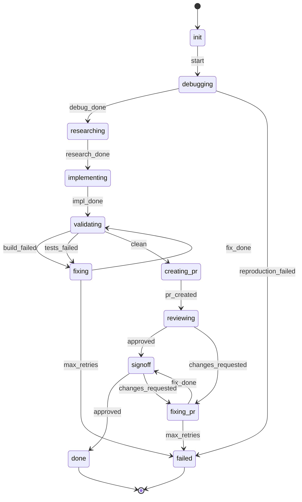

The `debugging` state runs `investigate-bug` against the GitHub issue before the
researcher sees it. It reproduces the reported behaviour, investigates the root cause,
and commits a failing repro test and any diagnostic logging to the feature branch. Its
output — a structured root-cause report — is passed to the researcher as additional
context when writing the task brief. If the bug cannot be reproduced the pipeline fails
immediately with `reproduction_failed`.

The `signoff` state runs three tasks in parallel before making its decision:

1. **`review-sign-off`** — checks that all PR review threads have been resolved and scans
   modified files for new code quality issues (Priority 1–4). Resolves satisfied threads;
   leaves unresolved threads where the developer disagreed and the reviewer is pushing back.
2. **`researcher-validate`** — checks each exit criterion proposed by the researcher against
   the actual code and tests. Any `fail` or `partial` result counts as a failure.
3. **Script validation** — runs `validate-build` then (if clean) `validate-tests`.

All three must pass for `signoff` to emit `approved`. Any failure from any task emits
`changes_requested` and routes back to `fixing_pr`, with accumulated failure details.

`reviewing`'s own `approved` trigger routes to `signoff`, never directly to `done` — every
approval, including a clean first pass with no `fixing_pr` cycle, runs the full signoff checks
before the pipeline finishes.

`signoff` carries the `signoff` pipeline event directly — `dev_team.py` resolves this project's
`before-signoff`/`after-signoff-approved` instructions (converting the PR to ready, assigning the
work item, requesting a review, etc.) around `SignoffStep`'s own resolution and dispatches them as
their own pipeline steps, so a project can configure or disable each piece independently without
needing a separate hand-off state or agent turn.
