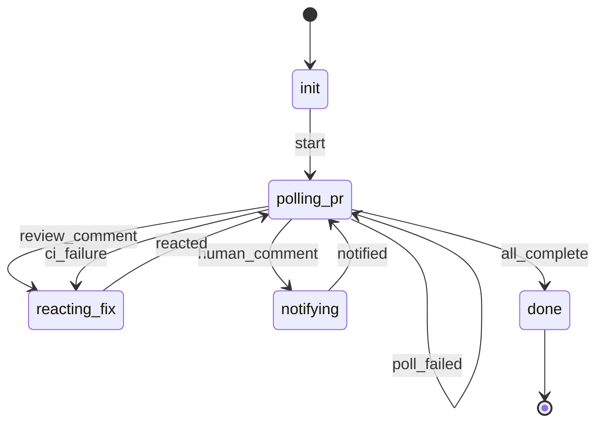

A strict structural subset of `monitor-stack-plan.md`: no `bootstrapping`, `syncing_stack`/
`scanning_stack_events` split, `resolving_conflict`, `continuing_rebase`, `cleaning_up`, or
`failed` — `pr_list_poll.py` never touches `gh stack`, so there is no cascade to sync, no
worktree of this monitor's own to bootstrap or later remove, and no rebase conflict concept at
all. `polling_pr` runs `pr_list_poll.py` against a fixed, explicit list of PR numbers
(`ctx.pr_numbers`) and cycles indefinitely on `no_change` until every given PR has merged
(`all_complete`).

`poll_failed` is reachable when the script exits 0 but produces unparseable/unexpected output — a
genuine script crash (non-zero exit) is caught generically by `workflow-orchestrate`'s own
dispatch-result check before `handle_results()` is ever reached, the same as a failed
`spawn_agent` item.

`reacting_fix`/`notifying` are shared verbatim with `monitor-stack-plan.md` — see that asset's own
notes for their behavior; both poll steps set `ctx.poll_event_task_id` identically.
