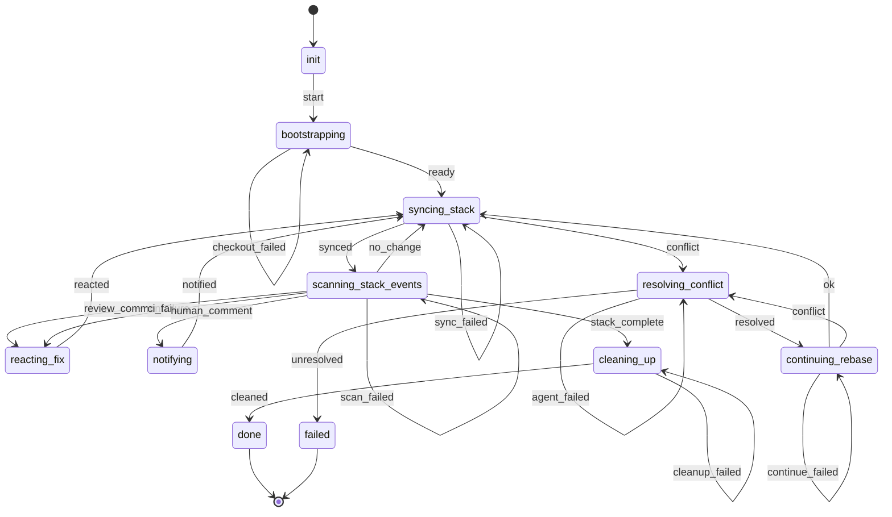

This is a long-lived monitor, not a pipeline that terminates on its own steady-state path —
`syncing_stack`/`scanning_stack_events` cycle indefinitely on `no_change` until `stack_complete`
(every task in the target set has merged) or an unresolved rebase conflict reaches `failed`.

`gh stack sync` and event-scanning are two separate operations (`syncing_stack` running
`stack_sync.py`, `scanning_stack_events` running `stack_scan.py`) rather than one combined poll
state, so each is independently visible, testable, and failable — `sync_failed`/`scan_failed` are
reachable when the underlying script exits 0 but produces unparseable/unexpected output (the
same "ran but produced no usable result" shape `DebugStep`/`ResearchStep` already handle for a
failed agent spawn); a genuine script crash (non-zero exit) is caught generically by
`workflow-orchestrate`'s own dispatch-result check before either state's `handle_results()` is
ever reached, exactly like a failed `spawn_agent` item — no diagram edge represents that case,
matching `implement-task-plan.md`'s own convention.

`bootstrapping` only does real work when this session bootstrapped its own dedicated worktree
(`ctx.own_worktree` — the `concurrent-orchestrate` auto-start path); the `/watch-stack` in-session
path (already on a real stack member branch) passes through immediately. It runs
`stack_bootstrap.py`, which derives the epic's own trunk branch from the context file's own
Project Configuration, finds the bottom-most open PR based on it, and calls `stack_checkout.py` —
the one operation that can materialize `gh-stack` awareness into a worktree that never ran
`init`/`add` for this stack. On success it also records this session's own worktree path/branch
(`watch_worktree_path`/`watch_worktree_branch`) for `cleaning_up` to later remove.

`reacting_fix` (spawns `fix-pr` against the *affected task's own* context file, never this
monitor's own) and `notifying` (the `"notify"` action verb, a direct `PushNotification` — never
`fix-pr`, since a human comment deserves a personal response, not a bot edit) are shared verbatim
with `monitor-pr-plan.md`; both poll paths set `ctx.poll_event_task_id` identically before
transitioning into either state.

`resolving_conflict`/`continuing_rebase` handle the rebase-cascade conflict a `gh stack sync` can
leave mid-flight: `resolving_conflict` determines which task's branch is conflicted from
`.git/rebase-merge`/`.git/rebase-apply`, spawns the developer agent's `resolve-rebase-conflict`
skill against that *task's own* context file, and reads back its `resolved`/`unresolved` verdict
(after explicitly merging the agent's scratch deliverable, since nothing else ever re-invokes the
pipeline for that task's own work item to do so). `resolved` resumes the cascade via
`continuing_rebase`'s `stack_rebase_continue.py` — completing only the one branch's own rebase
isn't enough to reconcile a multi-branch stack — which may itself surface a *new* conflict further
up the stack (`continuing_rebase --> resolving_conflict : conflict`, re-deriving the new
conflicting branch fresh). `unresolved` is a deliberate, permanent halt for the whole epic — one
stuck task already blocks every later stack member's own cascade regardless of how many monitor
processes exist.

`cleaning_up` removes this session's own dedicated worktree/branch only if it bootstrapped one
(`ctx.own_worktree`); the `/watch-stack` in-session path never allocated one of its own and skips
straight to `done`. A failed removal never reports `cleaned` — it retries via `cleanup_failed`
instead, escalating through the standard `consecutive_failures` mechanism rather than silently
reporting a clean halt.
